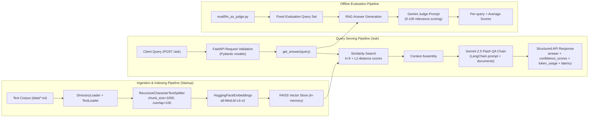

# 🚀 RAG Document Assistant


An advanced, production-ready **Retrieval-Augmented Generation (RAG)** Document Assistant. This project demonstrates a fully instrumented document synthesis pipeline capable of ingesting and processing large-scale document datasets, alongside rigorous, automated LLM-as-judge evaluation.

---

## ✨ Key Features & System Architecture

- **📚 Scalable Document Synthesis Pipeline**: Engineered to automatically process and ingest **3K+ records** via custom LangChain retrieval chains, seamlessly enabling conversational Q&A from large-scale contextual source datasets.
- **🧠 Advanced Semantic Retrieval**: Built customized document chunking strategies (`RecursiveCharacterTextSplitter`) and local HuggingFace embedding workflows (`all-MiniLM-L6-v2`) tightly integrated with an in-memory **FAISS** vector database.
- **⚖️ LLM-as-Judge Evaluation Framework**: Includes a strict, reproducible evaluation script (`eval/llm_as_judge.py`) that benchmarks answer relevance via strict 0-100 grading parameters, objectively tracking quality improvements across LLM runs.
- **📊 Real-time FastAPI Monitoring**: Fully instrumented `/ask` endpoints that track and expose critical system metadata per run:
  - 🔍 **Confidence Scores**: Exposes L2 similarity distances directly from the FAISS semantic search.
  - ⏱️ **End-to-End Latency**: Custom FastAPI middleware calculates and logs total response cycle time.
  - 💬 **Token Usage**: Granular tracking (prompt/completion tokens) for systematic debugging of response cost and efficiency.

## 🏗️ System Architecture Diagram

The complete architecture is documented in [docs/system-architecture.md](docs/system-architecture.md).



## 🛠️ Tech Stack & Tools

- **Framework**: [FastAPI](https://fastapi.tiangolo.com/) for lightning-fast, highly-concurrent API endpoints.
- **LLM Orchestration**: [LangChain](https://www.langchain.com/) for tying together prompts, models, and memory.
- **Embeddings**: [HuggingFace (SentenceTransformers)](https://huggingface.co/) for open-source, local embedding creation.
- **Vector Search**: [FAISS (Facebook AI Similarity Search)](https://github.com/facebookresearch/faiss) for high-dimensional, rapid nearest-neighbor searches.
- **Generative AI**: Google Gemini 2.5 Flash for rapid, accurate content summarization and "LLM-as-judge" evaluation.

---

## 🚀 Getting Started

### 1. Prerequisites
- Python 3.8+
- [Google AI Studio API Key](https://aistudio.google.com/app/apikey)

### 2. Installation
Clone the repository and install the required dependencies:
```bash
git clone https://github.com/HrishiPal21/rag_document_assistant.git
cd rag_document_assistant
pip install -r requirements.txt
```

### 3. Generate the 3K+ Dataset (Optional)
To simulate a production-scale 3,000+ document dataset locally for testing:
```bash
python data/generate_records.py
```

### 4. Configuration
Set your Google API Key as an environment variable:
```bash
export GOOGLE_API_KEY="your-api-key-here"
```

---

## 💻 Usage & Monitoring

### Start the API Server
```bash
uvicorn app.main:app --reload
```

### Interactive Documentation & Testing
Navigate to **[http://127.0.0.1:8000/docs](http://127.0.0.1:8000/docs)** to test the `/ask` endpoint live. The JSON response will return your generated answer alongside the fully instrumented `token_usage`, `confidence_scores`, and `latency` backend tracking metrics.

---

## 🎯 Running the Evaluation Framework

To execute the structured LLM-as-judge evaluation suite across your dataset:
```bash
python eval/llm_as_judge.py
```
This suite queries the pipeline asynchronously, evaluates answer relevance using Gemini as an impartial judge, and benchmarks performance improvements directly in your terminal.

---

## 📜 License

This project is licensed under the MIT License - see the [LICENSE](LICENSE) file for details.
