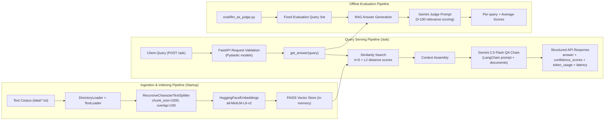

# System Architecture

This project is organized into three cooperating pipelines:

1. Ingestion and vector indexing on service startup.
2. Online query serving through the `/ask` API endpoint.
3. Offline LLM-as-judge evaluation for quality benchmarking.

## Component Roles

### 1) Ingestion and Indexing

- Reads `.txt` files from `data/`.
- Splits documents into retrieval-friendly chunks.
- Builds local semantic embeddings.
- Stores vectors in FAISS for fast nearest-neighbor search.

### 2) Query Serving

- Accepts user query at `/ask`.
- Validates payload with Pydantic request schema.
- Retrieves top-k semantically similar chunks from FAISS.
- Sends query + context to Gemini through LangChain chain.
- Returns answer and observability fields in one JSON response.

### 3) Evaluation

- Runs fixed benchmark queries.
- Reuses the same RAG answer pipeline.
- Uses a separate judge prompt to assign 0-100 relevance scores.
- Reports per-query metrics and aggregate average.

## Data and Control Flow Notes

- Retrieval confidence values are FAISS distances (lower is generally better).
- Token usage in responses is heuristic and intended for trend monitoring.
- The vector store is in-memory in this version (ephemeral across restarts).
- LLM calls require `GOOGLE_API_KEY` in environment configuration.
